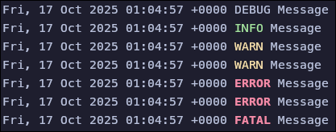
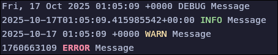
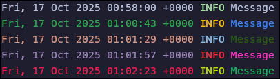
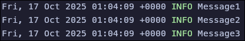

[](https://github.com/AndyLocks/logm/releases/tag/logm-v0.0.2)

A utility for formatting logs for UNIX-like systems.

# Usage

Reads `stdin` and formats it:

```bash
echo "Message" | logm
```


## Log levels

Logm supports the following **log levels**:

- Debug
- Info
- Warning
- Error
- Fatal

```bash
echo "Message" | logm debug
echo "Message" | logm info
echo "Message" | logm warn
echo "Message" | logm warning
echo "Message" | logm error
echo "Message" | logm err
echo "Message" | logm fatal
```



## Time

Logm supports the following **time formats**:

- rfc2822
- rfc3339
- *custom*

```bash
echo "Message" | logm debug rfc2822
echo "Message" | logm info rfc3339
echo "Message" | logm warn '%Y-%m-%d %H:%M:%S %z'
echo "Message" | logm err $(date +%s)
```



### Custom

The following patterns are supported:

| Spec.  | Example                            | Description                                                                                                                                           |
| ------ | ---------------------------------- | ----------------------------------------------------------------------------------------------------------------------------------------------------- |
| `%Y`   | `2001`                             | The full proleptic Gregorian year, zero-padded to 4 digits. |
| `%C`   | `20`                               | The proleptic Gregorian year divided by 100, zero-padded to 2 digits.| 
| `%y`   | `01`                               | The proleptic Gregorian year modulo 100, zero-padded to 2 digits. |
| `%m`   | `07`                               | Month number (01–12), zero-padded to 2 digits.                                                                                                        |
| `%b`   | `Jul`                              | Abbreviated month name. Always 3 letters.                                                                                                             |
| `%B`   | `July`                             | Full month name. Also accepts corresponding abbreviation in parsing.                                                                                  |
| `%h`   | `Jul`                              | Same to `%b`.                                                                                                                                         |
| `%d`   | `08`                               | Day number (01–31), zero-padded to 2 digits.                                                                                                          |
| `%e`   | `8`                                | Same to `%d` but space-padded. Same to `%_d`.                                                                                                         |
| `%a`   | `Sun`                              | Abbreviated weekday name. Always 3 letters.                                                                                                           |
| `%A`   | `Sunday`                           | Full weekday name. Also accepts corresponding abbreviation in parsing.                                                                                |
| `%w`   | `0`                                | Sunday = 0, Monday = 1, …, Saturday = 6.                                                                                                              |
| `%u`   | `7`                                | Monday = 1, Tuesday = 2, …, Sunday = 7. (ISO 8601)                                                                                                    |
| `%U`   | `28`                               | Week number starting with Sunday (00–53), zero-padded to 2 digits. |
| `%W`   | `27`                               | Same to `%U`, but week 1 starts with the first Monday in that year instead.                                                                           |
| `%G`   | `2001`                             | Same to `%Y` but uses the year number in ISO 8601 week date. |
| `%g`   | `01`                               | Same to `%y` but uses the year number in ISO 8601 week date. | 
| `%V`   | `27`                               | Same to `%U` but uses the week number in ISO 8601 week date (01–53). | 
| `%j`   | `189`                              | Day of the year (001–366), zero-padded to 3 digits.                                                                                                   |
| `%D`   | `07/08/01`                         | Month-day-year format. Same to `%m/%d/%y`.                                                                                                            |
| `%x`   | `07/08/01`                         | Same to `%D`.                                                                                                                                         |
| `%F`   | `2001-07-08`                       | Year-month-day format (ISO 8601). Same to `%Y-%m-%d`.                                                                                                 |
| `%v`   | `8-Jul-2001`                       | Day-month-year format. Same to `%e-%b-%Y`.                                                                                                            |
| `%H`   | `00`                               | Hour number (00–23), zero-padded to 2 digits.                                                                                                         |
| `%k`   | `0`                                | Same to `%H` but space-padded. Same to `%_H`.                                                                                                         |
| `%I`   | `12`                               | Hour number in 12-hour clocks (01–12), zero-padded to 2 digits.                                                                                       |
| `%l`   | `12`                               | Same to `%I` but space-padded. Same to `%_I`.                                                                                                         |
| `%P`   | `am`                               | `am` or `pm` in 12-hour clocks.                                                                                                                       |
| `%p`   | `AM`                               | `AM` or `PM` in 12-hour clocks.                                                                                                                       |
| `%M`   | `34`                               | Minute number (00–59), zero-padded to 2 digits.                                                                                                       |
| `%S`   | `60`                               | Second number (00–60), zero-padded to 2 digits. | 
| `%f`   | `026490000`                        | The fractional seconds (in nanoseconds) since last whole second. |
| `%.f`  | `.026490`                          | Similar to `.%f` but left-aligned. These all consume the leading dot. |
| `%.3f` | `.026`                             | Similar to `.%f` but left-aligned but fixed to a length of 3. |
| `%.6f` | `.026490`                          | Similar to `.%f` but left-aligned but fixed to a length of 6. |
| `%.9f` | `.026490000`                       | Similar to `.%f` but left-aligned but fixed to a length of 9. |
| `%3f`  | `026`                              | Similar to `%.3f` but without the leading dot. |
| `%6f`  | `026490`                           | Similar to `%.6f` but without the leading dot. |
| `%9f`  | `026490000`                        | Similar to `%.9f` but without the leading dot. |
| `%R`   | `00:34`                            | Hour-minute format. Same to `%H:%M`.                                                                                                                  |
| `%T`   | `00:34:60`                         | Hour-minute-second format. Same to `%H:%M:%S`.                                                                                                        |
| `%X`   | `00:34:60`                         | Same to `%T`.                                                                                                                                         |
| `%r`   | `12:34:60 AM`                      | Hour-minute-second format in 12-hour clocks. Same to `%I:%M:%S %p`.                                                                                   |
| `%Z`   | `ACST`                             | _Formatting only:_ Local time zone name.                                                                                                              |
| `%z`   | `+0930`                            | Offset from the local time to UTC (with UTC being `+0000`).                                                                                           |
| `%:z`  | `+09:30`                           | Same to `%z` but with a colon.                                                                                                                        |
| `%#z`  | `+09`                              | _Parsing only:_ Same to `%z` but allows minutes to be missing or present.                                                                             |
| `%c`   | `Sun Jul 8 00:34:60 2001`          | `ctime` date & time format. Same to `%a %b %e %T %Y` sans `\n`.                                                                                       |
| `%+`   | `2001-07-08T00:34:60.026490+09:30` | ISO 8601 / RFC 3339 date & time format. |
| `%s`   | `994518299`                        | UNIX timestamp, the number of seconds since 1970-01-01 00:00 UTC. |
| `%t`   |                                    | Literal tab (`\t`).                                                                                                                                   |
| `%n`   |                                    | Literal newline (`\n`).                                                                                                                               |
| `%%`   |                                    | Literal percent sign.                                                                                                                                 |

# Configuration

When you first start it up, a configuration file is automatically created in the `.config/logm` folder, where you can set up colors. By default, you'll see this:

```toml
debug = "white"
info = "green"
warning = "yellow"
error = "red"
fatal = "red"
message = "white"
time = "white"
```

All HEX codes are supported (e.g., `#FFFFFF` or even without `#`: `FFFFFF`) as well as some words:

- "black"
- "red"
- "green"
- "yellow"
- "blue"
- "magenta"
- "purple"
- "cyan"
- "white"
- "bright black"
- "bright red"
- "bright green"
- "bright yellow"
- "bright blue"
- "bright magenta"
- "bright cyan"
- "bright white"



# Features

There is support for multi-line input:

```bash
echo "Message1\nMessage2\nMessage3" | logm
```


